<!-- hero: monochrome ASCII portrait (types in) beside the extruded 3d ascii
     wordmark (wipes in left-to-right, then rocks on its vertical axis).
     widths are picked so both panels land at the same height.
     portrait: python scripts/prep_photo.py <photo> && python scripts/make_ascii_svg.py
     wordmark: python scripts/make_wordmark_svg.py --mode rock
     how the wordmark is built: docs/3d-ascii-wordmark.md -->

<h3><code>imzyrix@github ~ $ whoami</code></h3>

<table>
<tr>
<td valign="top"></td>
<td valign="top"></td>
</tr>
</table>

 
 

<!-- regenerate the portrait from your own photo:
       photo with a real/solid background -> python scripts/prep_photo.py <photo>
       avatar with a solid background       -> python scripts/prep_solid_bg.py <photo>
       then: python scripts/make_ascii_svg.py -->

<!-- animated contribution graph: real data, boxes reveal cell by cell
     (regenerated daily by .github/workflows/update-profile-art.yml) -->

<h3><code>imzyrix@github ~ $ ./contributions.sh</code></h3>

 
 

<!-- activity report: monthly bar chart + stat cards + weekday mix, rendered
     from the same data as the heatmap (regenerated daily) -->

<h3><code>imzyrix@github ~ $ ./activity.sh</code></h3>

 
 

<!-- live Discord presence: fetched from the public Lanyard API and rendered
     locally, regenerated daily by the same workflow.
     configure your Discord user ID via the DISCORD_USER_ID repo secret and
     join the Lanyard Discord server to expose your presence -->

<h3><code>imzyrix@github ~ $ ./presence.sh</code></h3>

 
 

 
 

<h3><code>imzyrix@github ~ $ ./links.sh</code></h3>

<b>builder · tinkerer · sysadmin-adjacent</b>

  <a href="https://github.com/ZyrixDevelopment"><code>@ZyrixDevelopment</code></a> ·
  <a href="https://github.com/aequiarch-org"><code>@aequiarch-org</code></a>

 

