<div align="center">

# imzyrix

**builder of tools, visuals & small worlds** · python · js/ts · three.js · webgl

```sh
~ $ whoami
imzyrix — systems, web & game-dev experiments
```

</div>

---

### `<imzyrix@github ~ $ ./contributions.sh>`

The heatmap below refreshes with real data every day via a GitHub Actions cron — no stats services, no token, no JavaScript.



<br><br>

### `<imzyrix@github ~ $ whoami>`

<table>
  <tr>
    <td valign="top"></td>
    <td valign="top"></td>
  </tr>
</table>

<br>

---

### How this profile is made

- **Portrait** — a photo turned into self-typing monochrome ASCII art (`avi-ascii.svg`).
- **Info card** — a neofetch-style panel that prints line by line (`info-card.svg`).
- **Heatmap** — my real 53-week contribution calendar, revealed diagonally and refreshed daily (`contrib-heatmap.svg`).
- **GitHub Actions** — a cron job re-scrapes public contribution data and commits a fresh SVG every day.

All art is committed to this repo and renders as plain SVG, so GitHub plays the animations with no scripts or inline CSS required.

> Want this for yourself? See the article behind this build for the full walkthrough.

<div align="center">

<br>
<sub>— generated by scripts in [`scripts/`](scripts) —</sub>

</div>
